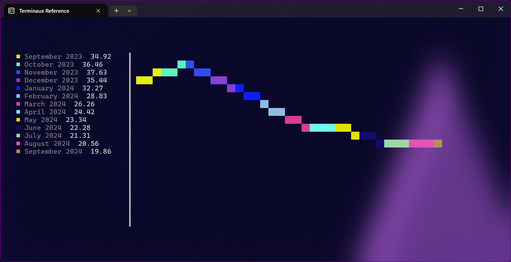
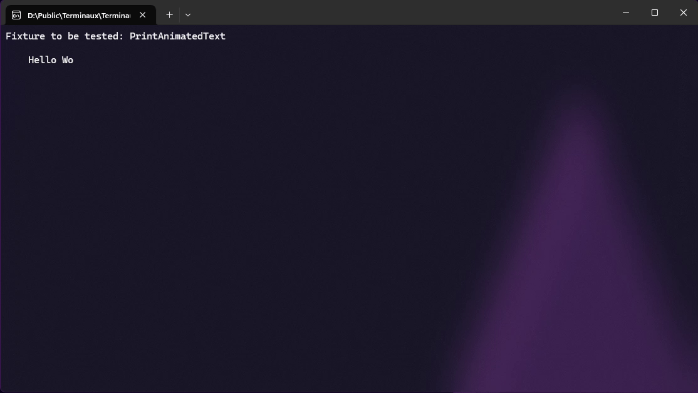
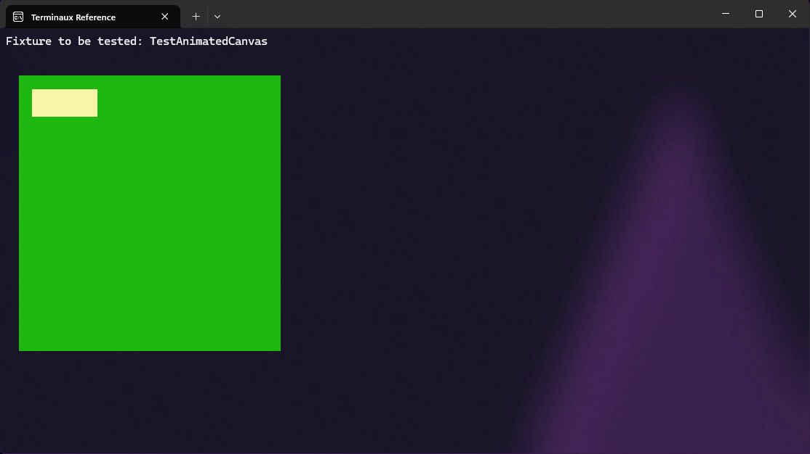

# Cyclic Writers

Cyclic writers are dynamic writers that can be rendered individually by making a new class instance of a renderable class that implements the `IStaticRenderable` interface that you can implement in your renderable class. Such writers can either be animated or static, and can be rendered either by calling their individual `Render()` function one by one or by putting renderable classes to a container and calling that container's `WriteContainer()` function from the `ContainerTools` class.


Most of the renderables also support colors, in which you can set with `UseColors` and their appropriate properties.


The following built-in cyclic writers are available:

* Shapes
  * `Circle`
  * `Arc`
  * `Ellipsis`
  * `Parallelogram`
  * `Rectangle`
  * `Square`
  * `Trapezoid`
  * `Triangle`
  * `Line`
* Charts
  * `BreakdownChart`
  * `BarChart`
  * `StickChart`
  * `StemLeafChart`
  * `LineChart`
  * `WinsLosses`
  * `AreaChart` (unfinished)
* Text
  * `AlignedFigletText`
  * `AlignedText`
  * `AnimatedText`
  * `BoundedText`
  * `FigletText`
  * `PowerLine`
  * `TextMarquee`
  * `Decoration`
  * `SyntaxText`
  * `TextPath`
* Artistic
  * `Border`
  * `Box`
  * `BoxFrame`
  * `Canvas`
  * `AnimatedCanvas`
* Misc
  * `Asciinema` (WIP)
  * `ProgressBar`
  * `ProgressBarNoText`
  * `SimpleProgress`
  * `Slider`
  * `Spinner`
    * Built-in spinners are available in the `BuiltinSpinners` class.
  * `Table` and `Calendars`
  * `Eraser`
  * `Keybindings`
  * `KeyShortcut`
  * `ListEntry`
  * `Listing`
  * `Emoji`
  * `Kaomoji`
  * `NerdFonts`
  * `Selection`

You can define a container by creating a new instance of the `Container` class and adding some of the renderables that can be identified by their name. You can also set their positions by using the `SetRenderablePosition()` function. If you don't want to use a container, you can use the `RenderRenderable()` function or the `WriteRenderable()` function to render a specific renderable in a specific position and to write the result to the console, respectively.


Some of the renderables may override the position variable for a renderable and may use the values from the renderables' properties.


In addition to that, you can manipulate with a renderable using the following functions:

* `IsRegistered()`: Checks to see if a renderable with this ID is registered or not.
* `RemoveRenderable()`: Removes a renderable with this ID.
* `GetRenderable()`: Gets a renderable instance from this ID.
* `GetRenderablePosition()`: Gets a renderable instance position from this ID.
* `GetRenderableNames()`: Gets an array of renderable IDs.

## Shapes

You can render the following shapes directly to your console:

### Circle

The circle writer allows you to write a circle to the console. It also allows you to either draw just an outline or the whole filled circle.



```csharp
var shape = new Circle(20, 2, 1);
TextWriterRaw.WriteRaw(shape.Render());
```

<figure><figcaption></figcaption></figure>



```csharp
var shape = new Circle(20, 2, 1, true);
TextWriterRaw.WriteRaw(shape.Render());
```

<figure><figcaption></figcaption></figure>



### Arc

This writer allows you to write an arc directly to the console with some parameters, such as custom inner and outer radius, and angle ranges.



```csharp
var arc = new Arc(20, 4, 2, ConsoleColors.Red)
{
    InnerRadius = 6,
    OuterRadius = 9,
    AngleStart = 360,
    AngleEnd = 100,
};
TextWriterRaw.WriteRaw(arc.Render());
```

<figure><figcaption></figcaption></figure>



```csharp
var arc = new Arc(20, 4, 2, ConsoleColors.Red)
{
    InnerRadius = 6,
    OuterRadius = 9,
    AngleStart = 360,
    AngleEnd = 100,
};
var arc2 = new Arc(20, 4, 2, ConsoleColors.Lime)
{
    InnerRadius = 6,
    OuterRadius = 9,
    AngleStart = 150,
    AngleEnd = 300,
};
var arc3 = new Arc(20, 4, 2, ConsoleColors.Blue)
{
    InnerRadius = 6,
    OuterRadius = 9,
    AngleStart = 100,
    AngleEnd = 150,
};
TextWriterRaw.WriteRaw(arc.Render());
TextWriterRaw.WriteRaw(arc2.Render());
TextWriterRaw.WriteRaw(arc3.Render());
```

<figure><figcaption></figcaption></figure>



```csharp
var arc = new Arc(20, 4, 2, ConsoleColors.Red)
{
    InnerRadius = 0,
    OuterRadius = 9,
    AngleStart = 170,
    AngleEnd = 120,
};
TextWriterRaw.WriteRaw(arc.Render());
```

<figure><figcaption></figcaption></figure>



```csharp
var arc = new Arc(20, 4, 2, ConsoleColors.Red)
{
    InnerRadius = 0,
    OuterRadius = 9,
    AngleStart = 170,
    AngleEnd = 120,
};
var arc2 = new Arc(20, 4, 2, ConsoleColors.Aqua)
{
    InnerRadius = 0,
    OuterRadius = 9,
    AngleStart = 120,
    AngleEnd = 170,
};
TextWriterRaw.WriteRaw(arc.Render());
TextWriterRaw.WriteRaw(arc2.Render());
```

<figure><figcaption></figcaption></figure>



### Ellipsis

This writer allows you to write an ellipsis directly to the console. It also allows you to either draw just an outline or the whole filled ellipsis.



```csharp
var shape = new Ellipsis(20, 15, 2, 1);
TextWriterRaw.WriteRaw(shape.Render());
```

<figure><figcaption></figcaption></figure>



```csharp
var shape = new Ellipsis(20, 15, 2, 1, true);
TextWriterRaw.WriteRaw(shape.Render());
```

<figure><figcaption></figcaption></figure>



### Parallelogram

This writer allows you to write a parallelogram to the console directly. You can specify whether to draw just the outline or the whole shape.



```csharp
var shape = new Parallelogram(20, 10, 2, 1);
TextWriterRaw.WriteRaw(shape.Render());
```

<figure><figcaption></figcaption></figure>



```csharp
var shape = new Parallelogram(20, 10, 2, 1, true);
TextWriterRaw.WriteRaw(shape.Render());
```

<figure><figcaption></figcaption></figure>



### Rectangle

This writer allows you to write a rectangle to the console directly. You can specify whether to print the whole shape or just the edges.



```csharp
var shape = new Rectangle(20, 10, 2, 1);
TextWriterRaw.WriteRaw(shape.Render());
```

<figure><figcaption></figcaption></figure>



```csharp
var shape = new Rectangle(20, 10, 2, 1, true);
TextWriterRaw.WriteRaw(shape.Render());
```

<figure><figcaption></figcaption></figure>



### Square

This shape basically renders a rectangle, but with just the height specified. In the console, the width is multiplied by two due to the space widths taking up only one cell. It basically renders a square.



```csharp
var shape = new Square(20, 2, 1);
TextWriterRaw.WriteRaw(shape.Render());
```

<figure><figcaption></figcaption></figure>



```csharp
var shape = new Square(20, 2, 1, true);
TextWriterRaw.WriteRaw(shape.Render());
```

<figure><figcaption></figcaption></figure>



### Trapezoid

This renders a trapezoid using a specified height, a top edge width, and a bottom edge width. You can also make it either render just the outline or as a full shape.



```csharp
var shape = new Trapezoid(10, 30, 20, 2, 1);
TextWriterRaw.WriteRaw(shape.Render());
```

<figure><figcaption></figcaption></figure>



```csharp
var shape = new Trapezoid(10, 30, 20, 2, 1, true);
TextWriterRaw.WriteRaw(shape.Render());
```

<figure><figcaption></figcaption></figure>



### Triangle

This renders either an equilateral triangle or an isosceles triangle to the console.



```csharp
var shape = new Triangle(30, 20, 2, 1);
TextWriterRaw.WriteRaw(shape.Render());
```

<figure><figcaption></figcaption></figure>



```csharp
var shape = new Triangle(30, 20, 2, 1, true);
TextWriterRaw.WriteRaw(shape.Render());
```

<figure><figcaption></figcaption></figure>



### Line

This renders either a rough line or a smooth line, and it can either be half-width or full-width.



```csharp
var line = new Line()
{
    StartPos = new(2, 2),
    EndPos = new(10, 5)
};
TextWriterRaw.WriteRaw(line.Render());
```

<figure><figcaption></figcaption></figure>



```csharp
var line = new Line()
{
    StartPos = new(2, 2),
    EndPos = new(10, 5),
    AntiAlias = true,
};
TextWriterRaw.WriteRaw(line.Render());
```

<figure><figcaption></figcaption></figure>



## Charts

Presenting numbers, especially when comparing device performance benchmark numbers, can sometimes be clearer if you use a chart instead of a table. In order to use charts, you must specify at least the chart elements that can be described as an array of `ChartElement` class instances, which is usually set in the `Elements` property. You can create a new element like this:

```csharp
var element = new ChartElement()
{
    Name = "Element 1",
    Value = 12,
};
```

You must specify at least the name and the value to identify your element. However, elements can either have a random color (if the `Color` property isn't specified) or a specific color. It can also be hidden from view by enabling the `Hidden` property.

### Breakdown chart

This gives you either a horizontal stick or a vertical stick that describes what part of the whole stick has taken per each item. This describes a breakdown of several items that you want to present.



```csharp
var chart = new BreakdownChart()
{
    Left = 1,
    Top = 2,
    InteriorWidth = 60,
    Showcase = true,
    Elements =
    [
        new()
        {
            Name = "C#",
            Value = 80,
        },
        new()
        {
            Name = "Java",
            Value = 13,
        },
        new()
        {
            Name = "C++",
            Value = 6.9,
        },
        new()
        {
            Name = "Shell",
            Value = 0.1,
        },
    ]
};
TextWriterRaw.WriteRaw(chart.Render());
```

<figure><figcaption></figcaption></figure>



```csharp
var chart = new BreakdownChart()
{
    Left = 1,
    Top = 2,
    InteriorWidth = 60,
    Elements =
    [
        new()
        {
            Name = "C#",
            Value = 80,
        },
        new()
        {
            Name = "Java",
            Value = 13,
        },
        new()
        {
            Name = "C++",
            Value = 6.9,
        },
        new()
        {
            Name = "Shell",
            Value = 0.1,
        },
    ]
};
TextWriterRaw.WriteRaw(chart.Render());
```

<figure><figcaption></figcaption></figure>



```csharp
var chart = new BreakdownChart()
{
    InteriorWidth = ConsoleWrapper.WindowWidth - 4,
    InteriorHeight = ConsoleWrapper.WindowHeight - 8,
    Left = 2,
    Top = 4,
    Showcase = true,
    Vertical = true,
    Elements =
    [
        new()
        {
            Name = "C#",
            Value = 80,
        },
        new()
        {
            Name = "Java",
            Value = 13,
        },
        new()
        {
            Name = "C++",
            Value = 6.9,
        },
        new()
        {
            Name = "Shell",
            Value = 0.1,
        },
    ]
};
TextWriterRaw.WriteRaw(chart.Render());
```

<figure><figcaption></figcaption></figure>



```csharp
var chart = new BreakdownChart()
{
    InteriorWidth = ConsoleWrapper.WindowWidth - 4,
    InteriorHeight = ConsoleWrapper.WindowHeight - 8,
    Left = 2,
    Top = 4,
    Vertical = true,
    Elements =
    [
        new()
        {
            Name = "C#",
            Value = 80,
        },
        new()
        {
            Name = "Java",
            Value = 13,
        },
        new()
        {
            Name = "C++",
            Value = 6.9,
        },
        new()
        {
            Name = "Shell",
            Value = 0.1,
        },
    ]
};
TextWriterRaw.WriteRaw(chart.Render());
```

<figure><figcaption></figcaption></figure>



### Bar chart

This gives you a horizontal bar chart that allows you to present various numbers in an amazing way for comparison.



```csharp
var chart = new BarChart()
{
    Left = 1,
    Top = 2,
    InteriorWidth = 60,
    Showcase = true,
    Elements =
    [
        new()
        {
            Name = "C#",
            Value = 80,
        },
        new()
        {
            Name = "Java",
            Value = 13,
        },
        new()
        {
            Name = "C++",
            Value = 6.9,
        },
        new()
        {
            Name = "Shell",
            Value = 0.1,
        },
    ]
};
TextWriterRaw.WriteRaw(chart.Render());
```

<figure><figcaption></figcaption></figure>



```csharp
var chart = new BarChart()
{
    Left = 1,
    Top = 2,
    InteriorWidth = 60,
    Elements =
    [
        new()
        {
            Name = "C#",
            Value = 80,
        },
        new()
        {
            Name = "Java",
            Value = 13,
        },
        new()
        {
            Name = "C++",
            Value = 6.9,
        },
        new()
        {
            Name = "Shell",
            Value = 0.1,
        },
    ]
};
TextWriterRaw.WriteRaw(chart.Render());
```

<figure><figcaption></figcaption></figure>



### Stick chart

This gives you a vertical bar chart that allows you to present various numbers in an amazing way for comparison.



```csharp
var chart = new StickChart()
{
    Left = 1,
    Top = 2,
    InteriorWidth = 60,
    InteriorHeight = 20,
    Showcase = true,
    Elements =
    [
        new()
        {
            Name = "C#",
            Value = 80,
        },
        new()
        {
            Name = "Java",
            Value = 13,
        },
        new()
        {
            Name = "C++",
            Value = 6.9,
        },
        new()
        {
            Name = "Shell",
            Value = 0.1,
        },
    ]
};
TextWriterRaw.WriteRaw(chart.Render());
```

<figure><figcaption></figcaption></figure>



```csharp
var chart = new StickChart()
{
    Left = 1,
    Top = 2,
    InteriorWidth = 60,
    InteriorHeight = 20,
    Elements =
    [
        new()
        {
            Name = "C#",
            Value = 80,
        },
        new()
        {
            Name = "Java",
            Value = 13,
        },
        new()
        {
            Name = "C++",
            Value = 6.9,
        },
        new()
        {
            Name = "Shell",
            Value = 0.1,
        },
    ]
};
TextWriterRaw.WriteRaw(chart.Render());
```

<figure><figcaption></figcaption></figure>



### Stem and Leaf Chart

This shows you a stem and leaf chart that describes the breakdown of the numbers, with the following conditions:

* The stem either represents the digit of tens and greater (if the number is not a decimal) or the numeric part (if the number is a decimal)
* The leaf either represents the digit of ones (if the number is not a decimal) or the decimal part with the precision of two decimal digits (if the number is a decimal)

```csharp
var chart = new StemLeafChart()
{
    Left = 2,
    Top = 4,
    Elements =
    [
        789,
        7,
        13,
        14,
        14.4,
        14.8,
        15.4,
        16.7,
        16.8,
        17.26,
        17.4286,
        18.345,
    ],
};
TextWriterRaw.WriteRaw(chart.Render());
```

<figure><figcaption></figcaption></figure>

### Line Charts

This allows you to render a line chart that shows you rises and falls of a specific data to the console.

```csharp
var chart = new LineChart()
{
    InteriorWidth = ConsoleWrapper.WindowWidth - 4,
    InteriorHeight = ConsoleWrapper.WindowHeight - 8,
    Left = 2,
    Top = 4,
    Showcase = true,
    Elements =
    [
        new()
        {
            Name = "September 2023",
            Value = 34.92,
        },
        new()
        {
            Name = "October 2023",
            Value = 36.46,
        },
        new()
        {
            Name = "November 2023",
            Value = 37.63,
        },
        new()
        {
            Name = "December 2023",
            Value = 35.44,
        },
        new()
        {
            Name = "January 2024",
            Value = 32.27,
        },
        new()
        {
            Name = "February 2024",
            Value = 28.83,
        },
        new()
        {
            Name = "March 2024",
            Value = 26.26,
        },
        new()
        {
            Name = "April 2024",
            Value = 24.42,
        },
        new()
        {
            Name = "May 2024",
            Value = 23.34,
        },
        new()
        {
            Name = "June 2024",
            Value = 22.28,
        },
        new()
        {
            Name = "July 2024",
            Value = 21.31,
        },
        new()
        {
            Name = "August 2024",
            Value = 20.56,
        },
        new()
        {
            Name = "September 2024",
            Value = 19.86,
        },
    ],
};
TextWriterRaw.WriteRaw(chart.Render());
```

<figure><figcaption></figcaption></figure>

### Wins and Losses

This chart allows you to visualize wins and losses for a company or for other things in your console.

```csharp
var chart = new WinsLosses()
{
    InteriorWidth = ConsoleWrapper.WindowWidth - 4,
    InteriorHeight = ConsoleWrapper.WindowHeight - 8,
    Left = 2,
    Top = 4,
    Showcase = true,
    Elements =
    [
        ("January 2023", new(){ Name = "Win", Value = 85.29 }, new(){ Name = "Loss", Value = 43.46 }),
        ("February 2023", new(){ Name = "Win", Value = 86.22 }, new(){ Name = "Loss", Value = 44.22 }),
        ("March 2023", new(){ Name = "Win", Value = 89.32 }, new(){ Name = "Loss", Value = 40.20 }),
        ("April 2023", new(){ Name = "Win", Value = 90.01 }, new(){ Name = "Loss", Value = 39.85 }),
        ("May 2023", new(){ Name = "Win", Value = 89.43 }, new(){ Name = "Loss", Value = 42.02 }),
        ("June 2023", new(){ Name = "Win", Value = 87.49 }, new(){ Name = "Loss", Value = 46.22 }),
    ],
};
TextWriterRaw.WriteRaw(chart.Render());
```

<figure><figcaption></figcaption></figure>

## Text

The following writers write text in different ways to the console.

### Aligned figlet text

This allows you to write an aligned Figlet text to the console.



```csharp
var text = new AlignedFigletText(FigletFonts.GetByName("small"), "Left")
{
    Settings = new()
    {
        Alignment = TextAlignment.Left
    }
};
var text2 = new AlignedFigletText(FigletFonts.GetByName("small"), "Middle")
{
    Settings = new()
    {
        Alignment = TextAlignment.Middle
    }
};
var text3 = new AlignedFigletText(FigletFonts.GetByName("small"), "Right")
{
    Settings = new()
    {
        Alignment = TextAlignment.Right
    }
};
TextWriterRaw.WriteRaw(text.Render());
TextWriterRaw.WriteRaw(text2.Render());
TextWriterRaw.WriteRaw(text3.Render());
```

<figure><figcaption></figcaption></figure>



```csharp
var text = new AlignedFigletText(FigletFonts.GetByName("small"), "Left")
{
    ForegroundColor = ConsoleColors.Red,
    Settings = new()
    {
        Alignment = TextAlignment.Left
    }
};
var text2 = new AlignedFigletText(FigletFonts.GetByName("small"), "Middle")
{
    ForegroundColor = ConsoleColors.Lime,
    Settings = new()
    {
        Alignment = TextAlignment.Middle
    }
};
var text3 = new AlignedFigletText(FigletFonts.GetByName("small"), "Right")
{
    ForegroundColor = ConsoleColors.Blue,
    Settings = new()
    {
        Alignment = TextAlignment.Right
    }
};
TextWriterRaw.WriteRaw(text.Render());
TextWriterRaw.WriteRaw(text2.Render());
TextWriterRaw.WriteRaw(text3.Render());
```

<figure><figcaption></figcaption></figure>



```csharp
var text = new AlignedFigletText(FigletFonts.GetByName("small"), "Left")
{
    Rainbow = true,
    Settings = new()
    {
        Alignment = TextAlignment.Left
    }
};
var text2 = new AlignedFigletText(FigletFonts.GetByName("small"), "Middle")
{
    Rainbow = true,
    Settings = new()
    {
        Alignment = TextAlignment.Middle
    }
};
var text3 = new AlignedFigletText(FigletFonts.GetByName("small"), "Right")
{
    Rainbow = true,
    Settings = new()
    {
        Alignment = TextAlignment.Right
    }
};
TextWriterRaw.WriteRaw(text.Render());
TextWriterRaw.WriteRaw(text2.Render());
TextWriterRaw.WriteRaw(text3.Render());
```

<figure><figcaption></figcaption></figure>



### Aligned text

This allows you to write an aligned text to the console.



```csharp
var text = new AlignedText("Left")
{
    Settings = new()
    {
        Alignment = TextAlignment.Left
    }
};
var text2 = new AlignedText("Middle")
{
    Settings = new()
    {
        Alignment = TextAlignment.Middle
    }
};
var text3 = new AlignedText("Right")
{
    Settings = new()
    {
        Alignment = TextAlignment.Right
    }
};
TextWriterRaw.WriteRaw(text.Render());
TextWriterRaw.WriteRaw(text2.Render());
TextWriterRaw.WriteRaw(text3.Render());
```

<figure><figcaption></figcaption></figure>



```csharp
var text = new AlignedText("Left")
{
    ForegroundColor = ConsoleColors.Red,
    Settings = new()
    {
        Alignment = TextAlignment.Left
    }
};
var text2 = new AlignedText("Middle")
{
    ForegroundColor = ConsoleColors.Lime,
    Settings = new()
    {
        Alignment = TextAlignment.Middle
    }
};
var text3 = new AlignedText("Right")
{
    ForegroundColor = ConsoleColors.Blue,
    Settings = new()
    {
        Alignment = TextAlignment.Right
    }
};
TextWriterRaw.WriteRaw(text.Render());
TextWriterRaw.WriteRaw(text2.Render());
TextWriterRaw.WriteRaw(text3.Render());
```

<figure><figcaption></figcaption></figure>



```csharp
var text = new AlignedText("Left")
{
    Rainbow = true,
    Settings = new()
    {
        Alignment = TextAlignment.Left
    }
};
var text2 = new AlignedText("Middle")
{
    Rainbow = true,
    Settings = new()
    {
        Alignment = TextAlignment.Middle
    }
};
var text3 = new AlignedText("Right")
{
    Rainbow = true,
    Settings = new()
    {
        Alignment = TextAlignment.Right
    }
};
TextWriterRaw.WriteRaw(text.Render());
TextWriterRaw.WriteRaw(text2.Render());
TextWriterRaw.WriteRaw(text3.Render());
```

<figure><figcaption></figcaption></figure>



### Animated text

This allows you to write text with animations using frames to define how the text is going to move.

```csharp
var animatedText = new AnimatedText()
{
    TextFrames =
    [
        "H",
        "He",
        "Hel",
        "Hell",
        "Hello",
        "Hello ",
        "Hello W",
        "Hello Wo",
        "Hello Wor",
        "Hello Worl",
        "Hello World",
        "Hello World!",
        "Hello World!",
        "Hello World!",
        "Hello World!",
        "Hello World!",
        "Hello World!",
        "Hello World!",
        "Hello World!",
        "Hello World!",
        "Hello World!",
        "Hello World!",
        "Hello World!",
        "Hello World!",
        "Hello World ",
        "Hello Worl  ",
        "Hello Wor   ",
        "Hello Wo    ",
        "Hello W     ",
        "Hello       ",
        "Hello       ",
        "Hell        ",
        "Hel         ",
        "He          ",
        "H           ",
        "            ",
    ],
    Left = 4,
    Top = 2,
    Width = 18,
};
for (int i = 0; i < animatedText.TextFrames.Length; i++)
{
    TextWriterRaw.WriteRaw(animatedText.Render());
    Thread.Sleep(100);
}
```

<figure><figcaption></figcaption></figure>

### Bounded text

This allows you to write text with boundaries to the console to allow enough information to fit in a specified width and height. This works either according to lines, or according to column and row of the invisible caret.



```csharp
var text = new BoundedText("This is a bounded text that wraps. This is a bounded text that wraps. This is a bounded text that wraps. This is a bounded text that wraps. This is a bounded text that wraps. This is a bounded text that wraps. This is a bounded text that wraps.")
{
    Settings = new()
    {
        Alignment = TextAlignment.Left
    },
    Width = 30,
    Height = 5,
    Line = 1,
};
var text2 = new BoundedText("This is a bounded text that wraps. This is a bounded text that wraps. This is a bounded text that wraps. This is a bounded text that wraps. This is a bounded text that wraps. This is a bounded text that wraps. This is a bounded text that wraps.")
{
    Settings = new()
    {
        Alignment = TextAlignment.Left
    },
    Width = 30,
    Height = 5,
    Left = 40,
    Line = 2,
};
TextWriterRaw.WriteRaw(text.Render());
TextWriterRaw.WriteRaw(text2.Render());
```

<figure><figcaption></figcaption></figure>



```csharp
var text = new BoundedText("This is a bounded text that wraps. This is a bounded text that wraps. This is a bounded text that wraps. This is a bounded text that wraps. This is a bounded text that wraps. This is a bounded text that wraps. This is a bounded text that wraps.")
{
    Settings = new()
    {
        Alignment = TextAlignment.Left
    },
    Width = 30,
    Height = 5,
    PositionWise = true,
    Column = 5,
    Row = 4,
};
var text2 = new BoundedText("This is a bounded text that wraps. This is a bounded text that wraps. This is a bounded text that wraps. This is a bounded text that wraps. This is a bounded text that wraps. This is a bounded text that wraps. This is a bounded text that wraps.")
{
    Settings = new()
    {
        Alignment = TextAlignment.Left
    },
    Width = 30,
    Height = 5,
    Left = 40,
	PositionWise = true,
	Column = 5,
	Row = 5,
};
TextWriterRaw.WriteRaw(text.Render());
TextWriterRaw.WriteRaw(text2.Render());
```

<figure><figcaption></figcaption></figure>



### Figlet text

This allows you to write unaligned Figlet text to the console.

```csharp
var text = new FigletText(FigletFonts.GetByName("small"), "Figlet text");
TextWriterRaw.WriteRaw(text.Render());
```

<figure><figcaption></figcaption></figure>

### Text marquee

This allows you to write an animated text marquee to the console.

```csharp
var stickScreen = new Screen()
{
    CycleFrequency = 50,
};
var marquee = new TextMarquee(
    "This is the test text marquee that's adjusted to your console width with the margin of 4 from both the " +
    "left and the right side, and is intentionally long to make the text scroll just like how music players " +
    "work.")
{
    LeftMargin = 4,
    RightMargin = 4,
};
try
{
    // First, clear the screen
    ColorTools.LoadBack();

    // Then, show the counter
    var stickScreenPart = new ScreenPart();
    stickScreenPart.Position(4, ConsoleWrapper.WindowHeight / 2);
    stickScreenPart.AddDynamicText(marquee.Render);
    stickScreen.AddBufferedPart("Test", stickScreenPart);
    ScreenTools.SetCurrent(stickScreen);
    ScreenTools.SetCurrentCyclic(stickScreen);
    ScreenTools.StartCyclicScreen();
    Input.ReadKey();
}
catch (Exception ex)
{
    InfoBoxModalColor.WriteInfoBoxModal($"Screen failed to render: {ex.Message}");
}
finally
{
    ScreenTools.StopCyclicScreen();
    ScreenTools.UnsetCurrent(stickScreen);
    ColorTools.LoadBack();
}
```

<figure><figcaption></figcaption></figure>

### Decoration

This allows you to create decorative renders for your text, but in a standalone form. You can also use this instance with aligned text instances to decorate your text with prefixes and suffixes.

```csharp
var decoration1 = new Decoration()
{
    ForegroundColor = ConsoleColors.Red,
    Start = "..:: ",
    End = " ::..",
};
var decoration2 = new Decoration()
{
    ForegroundColor = ConsoleColors.Lime,
    Start = "..::",
    End = "::..",
};
var decoration3 = new Decoration()
{
    ForegroundColor = ConsoleColors.Blue,
    Start = "..::",
    End = "::..",
};
TextWriterRaw.WritePlain("Full decoration:  " + decoration1.Render());
TextWriterRaw.WritePlain("Start decoration: " + decoration2.RenderStart());
TextWriterRaw.WritePlain("End decoration:   " + decoration3.RenderEnd() + "\n");

var alignedTextUndecorated = new AlignedText("Aligned text")
{
    ForegroundColor = ConsoleColors.Yellow,
    Top = 6,
    LeftMargin = "Aligned text without decoration: ".Length,
};
var alignedTextDecorated = new AlignedText("Aligned text")
{
    ForegroundColor = ConsoleColors.Yellow,
    UseColors = true,
    Top = 7,
    LeftMargin = "Aligned text without decoration: ".Length,
    Decoration = decoration2,
};
TextWriterRaw.WritePlain("Aligned text without decoration: " + alignedTextUndecorated.Render());
TextWriterRaw.WritePlain("Aligned text with decoration:    " + alignedTextDecorated.Render());
```

<figure><figcaption></figcaption></figure>

### Syntax text

You can render a syntax highlighted snippet of code using this renderable.


Please note that you must have the [`highlight`](http://andre-simon.de/zip/download.php) app installed.


```csharp
var chart = new SyntaxText()
{
	Top = 4,
	LeftMargin = 4,
	Syntax = "rust",
	Text =
		"""
        fn main() {
            // Comment
            println!("Hello World!");
        }
        """
};
TextWriterRaw.WriteRaw(chart.Render());
```

<figure><figcaption></figcaption></figure>

### Text path

You can render the decorated text path with this renderable so that the paths appear more elegant and simplified.

```csharp
var path1 = new TextPath()
{
    PathText = @"C:\WINDOWS\System32\very\long\path\so\that\we\can\read-this.txt",
    Left = 4,
    Top = 2,
    Width = 30,
};
var path2 = new TextPath()
{
    PathText = @"C:\WINDOWS\System32\taskmgr.exe",
    ForegroundColor = ConsoleColors.Green,
    LastPathColor = ConsoleColors.Blue,
    SeparatorColor = ConsoleColors.Yellow,
    RootDriveColor = ConsoleColors.Red,
    UseColors = true,
    Settings = new() { Alignment = TextAlignment.Left },
    Left = 4,
    Top = 4,
    Width = 40,
};
var path3 = new TextPath()
{
    PathText = @"/etc/grub.d/40_custom",
    ForegroundColor = ConsoleColors.Green,
    LastPathColor = ConsoleColors.Blue,
    SeparatorColor = ConsoleColors.Yellow,
    RootDriveColor = ConsoleColors.Red,
    UseColors = true,
    Settings = new() { Alignment = TextAlignment.Middle },
    Left = 4,
    Top = 5,
    Width = 40,
};
var path4 = new TextPath()
{
    PathText = @"Source/Public/Terminaux",
    ForegroundColor = ConsoleColors.Green,
    LastPathColor = ConsoleColors.Blue,
    SeparatorColor = ConsoleColors.Yellow,
    RootDriveColor = ConsoleColors.Red,
    UseColors = true,
    Settings = new() { Alignment = TextAlignment.Right },
    Left = 4,
    Top = 6,
    Width = 40,
};
TextWriterRaw.WriteRaw(path1.Render());
TextWriterRaw.WriteRaw(path2.Render());
TextWriterRaw.WriteRaw(path3.Render());
TextWriterRaw.WriteRaw(path4.Render());
```

<figure><figcaption></figcaption></figure>

## Artistic

This allows you to draw artistic stuff into the console so that you can build your own interactive console applications easily.

### Border

You can render a nice border to the console either without any text, just a title, a text, or box title and text. You can also customize the borders, such as drop shadows which we'll showcase in the `BoxFrame` renderable.



```csharp
var artistic = new Border()
{
    Left = 2,
    Top = 1,
    InteriorWidth = 20,
    InteriorHeight = 10,
};
TextWriterRaw.WriteRaw(artistic.Render());
```

<figure><figcaption></figcaption></figure>



```csharp
var artistic = new Border()
{
    Left = 2,
    Top = 1,
    InteriorWidth = 20,
    InteriorHeight = 10,
    Title = "Border title",
};
TextWriterRaw.WriteRaw(artistic.Render());
```

<figure><figcaption></figcaption></figure>



```csharp
var artistic = new Border()
{
    Left = 2,
    Top = 1,
    InteriorWidth = 20,
    InteriorHeight = 10,
    Text = "Border text",
};
TextWriterRaw.WriteRaw(artistic.Render());
```

<figure><figcaption></figcaption></figure>



```csharp
var artistic = new Border()
{
    Left = 2,
    Top = 1,
    InteriorWidth = 20,
    InteriorHeight = 10,
    Title = "Border title",
    Text = "Border text",
};
TextWriterRaw.WriteRaw(artistic.Render());
```

<figure><figcaption></figcaption></figure>




You can use the border settings to change the color of the border and to determine whether to display the entire border or not using a set of properties. For example, if you don't want to render the right edge, you can set `BorderRightFrameEnabled` to `false`.


### Box

You can render a box to the terminal easily.

```csharp
var artistic = new Box()
{
    Left = 2,
    Top = 1,
    InteriorWidth = 20,
    InteriorHeight = 10,
    Color = ConsoleColors.Magenta3
};
TextWriterRaw.WriteRaw(artistic.Render());
```

<figure><figcaption></figcaption></figure>

### Box frame

It's basically the same as a border, but without text support and without filling inside the box



```csharp
var artistic = new BoxFrame("")
{
    Left = 2,
    Top = 1,
    InteriorWidth = 20,
    InteriorHeight = 10,
};
TextWriterRaw.WriteRaw(artistic.Render());
```

<figure><figcaption></figcaption></figure>



```csharp
var artistic = new BoxFrame("Text")
{
    Left = 2,
    Top = 1,
    InteriorWidth = 20,
    InteriorHeight = 10,
};
TextWriterRaw.WriteRaw(artistic.Render());
```

<figure><figcaption></figcaption></figure>



```csharp
var artistic = new BoxFrame("")
{
    Left = 2,
    Top = 1,
    InteriorWidth = 20,
    InteriorHeight = 10,
    BackgroundColor = ConsoleColors.Aqua,
    FrameColor = ConsoleColors.Black,
    TitleColor = ConsoleColors.Black,
    DropShadow = true,
    ShadowColor = ConsoleColors.Teal,
};
TextWriterRaw.WriteRaw(artistic.Render());
```

<figure><figcaption></figcaption></figure>



```csharp
var artistic = new BoxFrame("Hello world!")
{
    Left = 2,
    Top = 1,
    InteriorWidth = 20,
    InteriorHeight = 10,
    BackgroundColor = ConsoleColors.Aqua,
    FrameColor = ConsoleColors.Black,
    TitleColor = ConsoleColors.Black,
    DropShadow = true,
    ShadowColor = ConsoleColors.Teal,
};
TextWriterRaw.WriteRaw(artistic.Render());
```

<figure><figcaption></figcaption></figure>



### Canvas

This is your sandbox for your awesome creations. This is done by coloring individual pixels with a color of your choice.



```csharp
var artistic = new Canvas()
{
	Left = 2,
	Top = 2,
	Color = ConsoleColors.Green,
	DoubleWidth = false,
	Transparent = true,
	InteriorWidth = 20,
	InteriorHeight = 20,
	Pixels =
	[
        // Draw the top part of the "T" letter
        new(2, 2) { CellColor = ConsoleColors.Yellow },
		new(3, 2) { CellColor = ConsoleColors.Yellow },
		new(4, 2) { CellColor = ConsoleColors.Yellow },
		new(5, 2) { CellColor = ConsoleColors.Yellow },
		new(6, 2) { CellColor = ConsoleColors.Yellow },
		new(7, 2) { CellColor = ConsoleColors.Yellow },
		new(8, 2) { CellColor = ConsoleColors.Yellow },
		new(9, 2) { CellColor = ConsoleColors.Yellow },
		new(10, 2) { CellColor = ConsoleColors.Yellow },
		new(11, 2) { CellColor = ConsoleColors.Yellow },
		new(12, 2) { CellColor = ConsoleColors.Yellow },
		new(13, 2) { CellColor = ConsoleColors.Yellow },
		new(14, 2) { CellColor = ConsoleColors.Yellow },
		new(15, 2) { CellColor = ConsoleColors.Yellow },
		new(16, 2) { CellColor = ConsoleColors.Yellow },
		new(17, 2) { CellColor = ConsoleColors.Yellow },
		new(18, 2) { CellColor = ConsoleColors.Yellow },
		new(2, 3) { CellColor = ConsoleColors.Yellow },
		new(3, 3) { CellColor = ConsoleColors.Yellow },
		new(4, 3) { CellColor = ConsoleColors.Yellow },
		new(5, 3) { CellColor = ConsoleColors.Yellow },
		new(6, 3) { CellColor = ConsoleColors.Yellow },
		new(7, 3) { CellColor = ConsoleColors.Yellow },
		new(8, 3) { CellColor = ConsoleColors.Yellow },
		new(9, 3) { CellColor = ConsoleColors.Yellow },
		new(10, 3) { CellColor = ConsoleColors.Yellow },
		new(11, 3) { CellColor = ConsoleColors.Yellow },
		new(12, 3) { CellColor = ConsoleColors.Yellow },
		new(13, 3) { CellColor = ConsoleColors.Yellow },
		new(14, 3) { CellColor = ConsoleColors.Yellow },
		new(15, 3) { CellColor = ConsoleColors.Yellow },
		new(16, 3) { CellColor = ConsoleColors.Yellow },
		new(17, 3) { CellColor = ConsoleColors.Yellow },
		new(18, 3) { CellColor = ConsoleColors.Yellow },
        
        // Draw the line of the "T" letter
        new(9, 3) { CellColor = ConsoleColors.Yellow },
		new(9, 4) { CellColor = ConsoleColors.Yellow },
		new(9, 5) { CellColor = ConsoleColors.Yellow },
		new(9, 6) { CellColor = ConsoleColors.Yellow },
		new(9, 7) { CellColor = ConsoleColors.Yellow },
		new(9, 8) { CellColor = ConsoleColors.Yellow },
		new(9, 9) { CellColor = ConsoleColors.Yellow },
		new(9, 10) { CellColor = ConsoleColors.Yellow },
		new(9, 11) { CellColor = ConsoleColors.Yellow },
		new(9, 12) { CellColor = ConsoleColors.Yellow },
		new(9, 13) { CellColor = ConsoleColors.Yellow },
		new(9, 14) { CellColor = ConsoleColors.Yellow },
		new(9, 15) { CellColor = ConsoleColors.Yellow },
		new(9, 16) { CellColor = ConsoleColors.Yellow },
		new(9, 17) { CellColor = ConsoleColors.Yellow },
		new(9, 18) { CellColor = ConsoleColors.Yellow },
		new(9, 19) { CellColor = ConsoleColors.Yellow },
		new(10, 3) { CellColor = ConsoleColors.Yellow },
		new(10, 4) { CellColor = ConsoleColors.Yellow },
		new(10, 5) { CellColor = ConsoleColors.Yellow },
		new(10, 6) { CellColor = ConsoleColors.Yellow },
		new(10, 7) { CellColor = ConsoleColors.Yellow },
		new(10, 8) { CellColor = ConsoleColors.Yellow },
		new(10, 9) { CellColor = ConsoleColors.Yellow },
		new(10, 10) { CellColor = ConsoleColors.Yellow },
		new(10, 11) { CellColor = ConsoleColors.Yellow },
		new(10, 12) { CellColor = ConsoleColors.Yellow },
		new(10, 13) { CellColor = ConsoleColors.Yellow },
		new(10, 14) { CellColor = ConsoleColors.Yellow },
		new(10, 15) { CellColor = ConsoleColors.Yellow },
		new(10, 16) { CellColor = ConsoleColors.Yellow },
		new(10, 17) { CellColor = ConsoleColors.Yellow },
		new(10, 18) { CellColor = ConsoleColors.Yellow },
		new(10, 19) { CellColor = ConsoleColors.Yellow },
		new(11, 3) { CellColor = ConsoleColors.Yellow },
		new(11, 4) { CellColor = ConsoleColors.Yellow },
		new(11, 5) { CellColor = ConsoleColors.Yellow },
		new(11, 6) { CellColor = ConsoleColors.Yellow },
		new(11, 7) { CellColor = ConsoleColors.Yellow },
		new(11, 8) { CellColor = ConsoleColors.Yellow },
		new(11, 9) { CellColor = ConsoleColors.Yellow },
		new(11, 10) { CellColor = ConsoleColors.Yellow },
		new(11, 11) { CellColor = ConsoleColors.Yellow },
		new(11, 12) { CellColor = ConsoleColors.Yellow },
		new(11, 13) { CellColor = ConsoleColors.Yellow },
		new(11, 14) { CellColor = ConsoleColors.Yellow },
		new(11, 15) { CellColor = ConsoleColors.Yellow },
		new(11, 16) { CellColor = ConsoleColors.Yellow },
		new(11, 17) { CellColor = ConsoleColors.Yellow },
		new(11, 18) { CellColor = ConsoleColors.Yellow },
		new(11, 19) { CellColor = ConsoleColors.Yellow },
	]
};
TextWriterRaw.WriteRaw(artistic.Render());
```

<figure><figcaption></figcaption></figure>



```csharp
var artistic = new Canvas()
{
	Left = 2,
	Top = 2,
	Color = ConsoleColors.Green,
	DoubleWidth = false,
	InteriorWidth = 20,
	InteriorHeight = 20,
	Pixels =
	[
        // Draw the top part of the "T" letter
        new(2, 2) { CellColor = ConsoleColors.Yellow },
		new(3, 2) { CellColor = ConsoleColors.Yellow },
		new(4, 2) { CellColor = ConsoleColors.Yellow },
		new(5, 2) { CellColor = ConsoleColors.Yellow },
		new(6, 2) { CellColor = ConsoleColors.Yellow },
		new(7, 2) { CellColor = ConsoleColors.Yellow },
		new(8, 2) { CellColor = ConsoleColors.Yellow },
		new(9, 2) { CellColor = ConsoleColors.Yellow },
		new(10, 2) { CellColor = ConsoleColors.Yellow },
		new(11, 2) { CellColor = ConsoleColors.Yellow },
		new(12, 2) { CellColor = ConsoleColors.Yellow },
		new(13, 2) { CellColor = ConsoleColors.Yellow },
		new(14, 2) { CellColor = ConsoleColors.Yellow },
		new(15, 2) { CellColor = ConsoleColors.Yellow },
		new(16, 2) { CellColor = ConsoleColors.Yellow },
		new(17, 2) { CellColor = ConsoleColors.Yellow },
		new(18, 2) { CellColor = ConsoleColors.Yellow },
		new(2, 3) { CellColor = ConsoleColors.Yellow },
		new(3, 3) { CellColor = ConsoleColors.Yellow },
		new(4, 3) { CellColor = ConsoleColors.Yellow },
		new(5, 3) { CellColor = ConsoleColors.Yellow },
		new(6, 3) { CellColor = ConsoleColors.Yellow },
		new(7, 3) { CellColor = ConsoleColors.Yellow },
		new(8, 3) { CellColor = ConsoleColors.Yellow },
		new(9, 3) { CellColor = ConsoleColors.Yellow },
		new(10, 3) { CellColor = ConsoleColors.Yellow },
		new(11, 3) { CellColor = ConsoleColors.Yellow },
		new(12, 3) { CellColor = ConsoleColors.Yellow },
		new(13, 3) { CellColor = ConsoleColors.Yellow },
		new(14, 3) { CellColor = ConsoleColors.Yellow },
		new(15, 3) { CellColor = ConsoleColors.Yellow },
		new(16, 3) { CellColor = ConsoleColors.Yellow },
		new(17, 3) { CellColor = ConsoleColors.Yellow },
		new(18, 3) { CellColor = ConsoleColors.Yellow },
        
        // Draw the line of the "T" letter
        new(9, 3) { CellColor = ConsoleColors.Yellow },
		new(9, 4) { CellColor = ConsoleColors.Yellow },
		new(9, 5) { CellColor = ConsoleColors.Yellow },
		new(9, 6) { CellColor = ConsoleColors.Yellow },
		new(9, 7) { CellColor = ConsoleColors.Yellow },
		new(9, 8) { CellColor = ConsoleColors.Yellow },
		new(9, 9) { CellColor = ConsoleColors.Yellow },
		new(9, 10) { CellColor = ConsoleColors.Yellow },
		new(9, 11) { CellColor = ConsoleColors.Yellow },
		new(9, 12) { CellColor = ConsoleColors.Yellow },
		new(9, 13) { CellColor = ConsoleColors.Yellow },
		new(9, 14) { CellColor = ConsoleColors.Yellow },
		new(9, 15) { CellColor = ConsoleColors.Yellow },
		new(9, 16) { CellColor = ConsoleColors.Yellow },
		new(9, 17) { CellColor = ConsoleColors.Yellow },
		new(9, 18) { CellColor = ConsoleColors.Yellow },
		new(9, 19) { CellColor = ConsoleColors.Yellow },
		new(10, 3) { CellColor = ConsoleColors.Yellow },
		new(10, 4) { CellColor = ConsoleColors.Yellow },
		new(10, 5) { CellColor = ConsoleColors.Yellow },
		new(10, 6) { CellColor = ConsoleColors.Yellow },
		new(10, 7) { CellColor = ConsoleColors.Yellow },
		new(10, 8) { CellColor = ConsoleColors.Yellow },
		new(10, 9) { CellColor = ConsoleColors.Yellow },
		new(10, 10) { CellColor = ConsoleColors.Yellow },
		new(10, 11) { CellColor = ConsoleColors.Yellow },
		new(10, 12) { CellColor = ConsoleColors.Yellow },
		new(10, 13) { CellColor = ConsoleColors.Yellow },
		new(10, 14) { CellColor = ConsoleColors.Yellow },
		new(10, 15) { CellColor = ConsoleColors.Yellow },
		new(10, 16) { CellColor = ConsoleColors.Yellow },
		new(10, 17) { CellColor = ConsoleColors.Yellow },
		new(10, 18) { CellColor = ConsoleColors.Yellow },
		new(10, 19) { CellColor = ConsoleColors.Yellow },
		new(11, 3) { CellColor = ConsoleColors.Yellow },
		new(11, 4) { CellColor = ConsoleColors.Yellow },
		new(11, 5) { CellColor = ConsoleColors.Yellow },
		new(11, 6) { CellColor = ConsoleColors.Yellow },
		new(11, 7) { CellColor = ConsoleColors.Yellow },
		new(11, 8) { CellColor = ConsoleColors.Yellow },
		new(11, 9) { CellColor = ConsoleColors.Yellow },
		new(11, 10) { CellColor = ConsoleColors.Yellow },
		new(11, 11) { CellColor = ConsoleColors.Yellow },
		new(11, 12) { CellColor = ConsoleColors.Yellow },
		new(11, 13) { CellColor = ConsoleColors.Yellow },
		new(11, 14) { CellColor = ConsoleColors.Yellow },
		new(11, 15) { CellColor = ConsoleColors.Yellow },
		new(11, 16) { CellColor = ConsoleColors.Yellow },
		new(11, 17) { CellColor = ConsoleColors.Yellow },
		new(11, 18) { CellColor = ConsoleColors.Yellow },
		new(11, 19) { CellColor = ConsoleColors.Yellow },
	]
};
TextWriterRaw.WriteRaw(artistic.Render());
```

<figure><figcaption></figcaption></figure>



```csharp
var artistic = new Canvas()
{
	Left = 2,
	Top = 2,
	Color = ConsoleColors.Green,
	Transparent = true,
	InteriorWidth = 20,
	InteriorHeight = 20,
	Pixels =
	[
        // Draw the top part of the "T" letter
        new(2, 2) { CellColor = ConsoleColors.Yellow },
		new(3, 2) { CellColor = ConsoleColors.Yellow },
		new(4, 2) { CellColor = ConsoleColors.Yellow },
		new(5, 2) { CellColor = ConsoleColors.Yellow },
		new(6, 2) { CellColor = ConsoleColors.Yellow },
		new(7, 2) { CellColor = ConsoleColors.Yellow },
		new(8, 2) { CellColor = ConsoleColors.Yellow },
		new(9, 2) { CellColor = ConsoleColors.Yellow },
		new(10, 2) { CellColor = ConsoleColors.Yellow },
		new(11, 2) { CellColor = ConsoleColors.Yellow },
		new(12, 2) { CellColor = ConsoleColors.Yellow },
		new(13, 2) { CellColor = ConsoleColors.Yellow },
		new(14, 2) { CellColor = ConsoleColors.Yellow },
		new(15, 2) { CellColor = ConsoleColors.Yellow },
		new(16, 2) { CellColor = ConsoleColors.Yellow },
		new(17, 2) { CellColor = ConsoleColors.Yellow },
		new(18, 2) { CellColor = ConsoleColors.Yellow },
		new(2, 3) { CellColor = ConsoleColors.Yellow },
		new(3, 3) { CellColor = ConsoleColors.Yellow },
		new(4, 3) { CellColor = ConsoleColors.Yellow },
		new(5, 3) { CellColor = ConsoleColors.Yellow },
		new(6, 3) { CellColor = ConsoleColors.Yellow },
		new(7, 3) { CellColor = ConsoleColors.Yellow },
		new(8, 3) { CellColor = ConsoleColors.Yellow },
		new(9, 3) { CellColor = ConsoleColors.Yellow },
		new(10, 3) { CellColor = ConsoleColors.Yellow },
		new(11, 3) { CellColor = ConsoleColors.Yellow },
		new(12, 3) { CellColor = ConsoleColors.Yellow },
		new(13, 3) { CellColor = ConsoleColors.Yellow },
		new(14, 3) { CellColor = ConsoleColors.Yellow },
		new(15, 3) { CellColor = ConsoleColors.Yellow },
		new(16, 3) { CellColor = ConsoleColors.Yellow },
		new(17, 3) { CellColor = ConsoleColors.Yellow },
		new(18, 3) { CellColor = ConsoleColors.Yellow },
        
        // Draw the line of the "T" letter
        new(9, 3) { CellColor = ConsoleColors.Yellow },
		new(9, 4) { CellColor = ConsoleColors.Yellow },
		new(9, 5) { CellColor = ConsoleColors.Yellow },
		new(9, 6) { CellColor = ConsoleColors.Yellow },
		new(9, 7) { CellColor = ConsoleColors.Yellow },
		new(9, 8) { CellColor = ConsoleColors.Yellow },
		new(9, 9) { CellColor = ConsoleColors.Yellow },
		new(9, 10) { CellColor = ConsoleColors.Yellow },
		new(9, 11) { CellColor = ConsoleColors.Yellow },
		new(9, 12) { CellColor = ConsoleColors.Yellow },
		new(9, 13) { CellColor = ConsoleColors.Yellow },
		new(9, 14) { CellColor = ConsoleColors.Yellow },
		new(9, 15) { CellColor = ConsoleColors.Yellow },
		new(9, 16) { CellColor = ConsoleColors.Yellow },
		new(9, 17) { CellColor = ConsoleColors.Yellow },
		new(9, 18) { CellColor = ConsoleColors.Yellow },
		new(9, 19) { CellColor = ConsoleColors.Yellow },
		new(10, 3) { CellColor = ConsoleColors.Yellow },
		new(10, 4) { CellColor = ConsoleColors.Yellow },
		new(10, 5) { CellColor = ConsoleColors.Yellow },
		new(10, 6) { CellColor = ConsoleColors.Yellow },
		new(10, 7) { CellColor = ConsoleColors.Yellow },
		new(10, 8) { CellColor = ConsoleColors.Yellow },
		new(10, 9) { CellColor = ConsoleColors.Yellow },
		new(10, 10) { CellColor = ConsoleColors.Yellow },
		new(10, 11) { CellColor = ConsoleColors.Yellow },
		new(10, 12) { CellColor = ConsoleColors.Yellow },
		new(10, 13) { CellColor = ConsoleColors.Yellow },
		new(10, 14) { CellColor = ConsoleColors.Yellow },
		new(10, 15) { CellColor = ConsoleColors.Yellow },
		new(10, 16) { CellColor = ConsoleColors.Yellow },
		new(10, 17) { CellColor = ConsoleColors.Yellow },
		new(10, 18) { CellColor = ConsoleColors.Yellow },
		new(10, 19) { CellColor = ConsoleColors.Yellow },
		new(11, 3) { CellColor = ConsoleColors.Yellow },
		new(11, 4) { CellColor = ConsoleColors.Yellow },
		new(11, 5) { CellColor = ConsoleColors.Yellow },
		new(11, 6) { CellColor = ConsoleColors.Yellow },
		new(11, 7) { CellColor = ConsoleColors.Yellow },
		new(11, 8) { CellColor = ConsoleColors.Yellow },
		new(11, 9) { CellColor = ConsoleColors.Yellow },
		new(11, 10) { CellColor = ConsoleColors.Yellow },
		new(11, 11) { CellColor = ConsoleColors.Yellow },
		new(11, 12) { CellColor = ConsoleColors.Yellow },
		new(11, 13) { CellColor = ConsoleColors.Yellow },
		new(11, 14) { CellColor = ConsoleColors.Yellow },
		new(11, 15) { CellColor = ConsoleColors.Yellow },
		new(11, 16) { CellColor = ConsoleColors.Yellow },
		new(11, 17) { CellColor = ConsoleColors.Yellow },
		new(11, 18) { CellColor = ConsoleColors.Yellow },
		new(11, 19) { CellColor = ConsoleColors.Yellow },
	]
};
TextWriterRaw.WriteRaw(artistic.Render());
```

<figure><figcaption></figcaption></figure>



```csharp
var artistic = new Canvas()
{
	Left = 2,
	Top = 2,
	Color = ConsoleColors.Green,
	InteriorWidth = 20,
	InteriorHeight = 20,
	Pixels =
	[
        // Draw the top part of the "T" letter
        new(2, 2) { CellColor = ConsoleColors.Yellow },
		new(3, 2) { CellColor = ConsoleColors.Yellow },
		new(4, 2) { CellColor = ConsoleColors.Yellow },
		new(5, 2) { CellColor = ConsoleColors.Yellow },
		new(6, 2) { CellColor = ConsoleColors.Yellow },
		new(7, 2) { CellColor = ConsoleColors.Yellow },
		new(8, 2) { CellColor = ConsoleColors.Yellow },
		new(9, 2) { CellColor = ConsoleColors.Yellow },
		new(10, 2) { CellColor = ConsoleColors.Yellow },
		new(11, 2) { CellColor = ConsoleColors.Yellow },
		new(12, 2) { CellColor = ConsoleColors.Yellow },
		new(13, 2) { CellColor = ConsoleColors.Yellow },
		new(14, 2) { CellColor = ConsoleColors.Yellow },
		new(15, 2) { CellColor = ConsoleColors.Yellow },
		new(16, 2) { CellColor = ConsoleColors.Yellow },
		new(17, 2) { CellColor = ConsoleColors.Yellow },
		new(18, 2) { CellColor = ConsoleColors.Yellow },
		new(2, 3) { CellColor = ConsoleColors.Yellow },
		new(3, 3) { CellColor = ConsoleColors.Yellow },
		new(4, 3) { CellColor = ConsoleColors.Yellow },
		new(5, 3) { CellColor = ConsoleColors.Yellow },
		new(6, 3) { CellColor = ConsoleColors.Yellow },
		new(7, 3) { CellColor = ConsoleColors.Yellow },
		new(8, 3) { CellColor = ConsoleColors.Yellow },
		new(9, 3) { CellColor = ConsoleColors.Yellow },
		new(10, 3) { CellColor = ConsoleColors.Yellow },
		new(11, 3) { CellColor = ConsoleColors.Yellow },
		new(12, 3) { CellColor = ConsoleColors.Yellow },
		new(13, 3) { CellColor = ConsoleColors.Yellow },
		new(14, 3) { CellColor = ConsoleColors.Yellow },
		new(15, 3) { CellColor = ConsoleColors.Yellow },
		new(16, 3) { CellColor = ConsoleColors.Yellow },
		new(17, 3) { CellColor = ConsoleColors.Yellow },
		new(18, 3) { CellColor = ConsoleColors.Yellow },
        
        // Draw the line of the "T" letter
        new(9, 3) { CellColor = ConsoleColors.Yellow },
		new(9, 4) { CellColor = ConsoleColors.Yellow },
		new(9, 5) { CellColor = ConsoleColors.Yellow },
		new(9, 6) { CellColor = ConsoleColors.Yellow },
		new(9, 7) { CellColor = ConsoleColors.Yellow },
		new(9, 8) { CellColor = ConsoleColors.Yellow },
		new(9, 9) { CellColor = ConsoleColors.Yellow },
		new(9, 10) { CellColor = ConsoleColors.Yellow },
		new(9, 11) { CellColor = ConsoleColors.Yellow },
		new(9, 12) { CellColor = ConsoleColors.Yellow },
		new(9, 13) { CellColor = ConsoleColors.Yellow },
		new(9, 14) { CellColor = ConsoleColors.Yellow },
		new(9, 15) { CellColor = ConsoleColors.Yellow },
		new(9, 16) { CellColor = ConsoleColors.Yellow },
		new(9, 17) { CellColor = ConsoleColors.Yellow },
		new(9, 18) { CellColor = ConsoleColors.Yellow },
		new(9, 19) { CellColor = ConsoleColors.Yellow },
		new(10, 3) { CellColor = ConsoleColors.Yellow },
		new(10, 4) { CellColor = ConsoleColors.Yellow },
		new(10, 5) { CellColor = ConsoleColors.Yellow },
		new(10, 6) { CellColor = ConsoleColors.Yellow },
		new(10, 7) { CellColor = ConsoleColors.Yellow },
		new(10, 8) { CellColor = ConsoleColors.Yellow },
		new(10, 9) { CellColor = ConsoleColors.Yellow },
		new(10, 10) { CellColor = ConsoleColors.Yellow },
		new(10, 11) { CellColor = ConsoleColors.Yellow },
		new(10, 12) { CellColor = ConsoleColors.Yellow },
		new(10, 13) { CellColor = ConsoleColors.Yellow },
		new(10, 14) { CellColor = ConsoleColors.Yellow },
		new(10, 15) { CellColor = ConsoleColors.Yellow },
		new(10, 16) { CellColor = ConsoleColors.Yellow },
		new(10, 17) { CellColor = ConsoleColors.Yellow },
		new(10, 18) { CellColor = ConsoleColors.Yellow },
		new(10, 19) { CellColor = ConsoleColors.Yellow },
		new(11, 3) { CellColor = ConsoleColors.Yellow },
		new(11, 4) { CellColor = ConsoleColors.Yellow },
		new(11, 5) { CellColor = ConsoleColors.Yellow },
		new(11, 6) { CellColor = ConsoleColors.Yellow },
		new(11, 7) { CellColor = ConsoleColors.Yellow },
		new(11, 8) { CellColor = ConsoleColors.Yellow },
		new(11, 9) { CellColor = ConsoleColors.Yellow },
		new(11, 10) { CellColor = ConsoleColors.Yellow },
		new(11, 11) { CellColor = ConsoleColors.Yellow },
		new(11, 12) { CellColor = ConsoleColors.Yellow },
		new(11, 13) { CellColor = ConsoleColors.Yellow },
		new(11, 14) { CellColor = ConsoleColors.Yellow },
		new(11, 15) { CellColor = ConsoleColors.Yellow },
		new(11, 16) { CellColor = ConsoleColors.Yellow },
		new(11, 17) { CellColor = ConsoleColors.Yellow },
		new(11, 18) { CellColor = ConsoleColors.Yellow },
		new(11, 19) { CellColor = ConsoleColors.Yellow },
	]
};
TextWriterRaw.WriteRaw(artistic.Render());
```

<figure><figcaption></figcaption></figure>



### Animated canvases

You can make animated canvases using the `AnimatedCanvas` class. It allows you to define canvas frames that describe a group of arrays of cell properties. They are changed sequentially to form an animated canvas. The example below is taken from [this file](https://github.com/Aptivi/Terminaux/blob/main/Terminaux.Console/Fixtures/Cases/Writer/TestAnimatedCanvas.cs).

<figure><figcaption></figcaption></figure>

## Misc

This category contains all other cyclic writers that don't fit in the above categories.

### Asciinema

This cyclic writer allows you to render a recorded Asciinema cast file to the terminal.


This feature is work in progress.


### Progress bar

Progress bars describe how much of a progress was done for the current task. You can make the progress bar either with text or without text. Progress bars can either be determinate (at which you can know the progress) or indeterminate (at which the process is not determined)

#### Progress bar with text

This writer allows you to show a progress bar while allowing you to describe what is going on during the process.



```csharp
var stickScreen = new Screen()
{
    CycleFrequency = 50,
};
var progressBar = new ProgressBar(
    "This is the test progress bar that contains a scrolling marquee.", 0, 100)
{
    LeftMargin = 4,
    RightMargin = 4,
};
try
{
    // First, clear the screen
    ColorTools.LoadBack();

    // Then, show the progress bar
    var stickScreenPart = new ScreenPart();
    stickScreenPart.Position(4, ConsoleWrapper.WindowHeight - 1);
    stickScreenPart.AddDynamicText(progressBar.Render);
    stickScreen.AddBufferedPart("Test", stickScreenPart);
    ScreenTools.SetCurrent(stickScreen);
    ScreenTools.SetCurrentCyclic(stickScreen);
    ScreenTools.StartCyclicScreen();

    // Finally, increment the progress bar until it's full
    for (int progress = 0; progress < 100; progress++)
    {
        progressBar.Position = progress;
        Thread.Sleep(100);
    }
}
catch (Exception ex)
{
    InfoBoxModalColor.WriteInfoBoxModal($"Screen failed to render: {ex.Message}");
}
finally
{
    ScreenTools.StopCyclicScreen();
    ScreenTools.UnsetCurrent(stickScreen);
    ColorTools.LoadBack();
}
```

<figure><figcaption></figcaption></figure>



```csharp
var stickScreen = new Screen()
{
    CycleFrequency = 50,
};
var progressBar = new ProgressBar(
    "This is the test progress bar that contains a scrolling marquee.", 0, 100)
{
    LeftMargin = 4,
    RightMargin = 4,
    Indeterminate = true,
};
try
{
    // First, clear the screen
    ColorTools.LoadBack();

    // Then, show the progress bar
    var stickScreenPart = new ScreenPart();
    stickScreenPart.Position(4, ConsoleWrapper.WindowHeight - 1);
    stickScreenPart.AddDynamicText(progressBar.Render);
    stickScreen.AddBufferedPart("Test", stickScreenPart);
    ScreenTools.SetCurrent(stickScreen);
    ScreenTools.SetCurrentCyclic(stickScreen);
    ScreenTools.StartCyclicScreen();

    // Finally, increment the progress bar until it's full
    for (int progress = 0; progress < 100; progress++)
    {
        progressBar.Position = progress;
        Thread.Sleep(100);
    }
}
catch (Exception ex)
{
    InfoBoxModalColor.WriteInfoBoxModal($"Screen failed to render: {ex.Message}");
}
finally
{
    ScreenTools.StopCyclicScreen();
    ScreenTools.UnsetCurrent(stickScreen);
    ColorTools.LoadBack();
}
```

<figure><figcaption></figcaption></figure>



#### Progress bar without text

This writer allows you to show a progress bar without any text.



```csharp
var stickScreen = new Screen()
{
    CycleFrequency = 50,
};
var progressBar = new ProgressBarNoText(0, 100)
{
    LeftMargin = 4,
    RightMargin = 4,
};
try
{
    // First, clear the screen
    ColorTools.LoadBack();

    // Then, show the progress bar
    var stickScreenPart = new ScreenPart();
    stickScreenPart.Position(4, ConsoleWrapper.WindowHeight - 1);
    stickScreenPart.AddDynamicText(progressBar.Render);
    stickScreen.AddBufferedPart("Test", stickScreenPart);
    ScreenTools.SetCurrent(stickScreen);
    ScreenTools.SetCurrentCyclic(stickScreen);
    ScreenTools.StartCyclicScreen();

    // Finally, increment the progress bar until it's full
    for (int progress = 0; progress < 100; progress++)
    {
        progressBar.Position = progress;
        Thread.Sleep(100);
    }
}
catch (Exception ex)
{
    InfoBoxModalColor.WriteInfoBoxModal($"Screen failed to render: {ex.Message}");
}
finally
{
    ScreenTools.StopCyclicScreen();
    ScreenTools.UnsetCurrent(stickScreen);
    ColorTools.LoadBack();
}
```

<figure><figcaption></figcaption></figure>



```csharp
var stickScreen = new Screen()
{
    CycleFrequency = 50,
};
var progressBar = new ProgressBarNoText(0, 100)
{
    LeftMargin = 4,
    RightMargin = 4,
    Indeterminate = true,
};
try
{
    // First, clear the screen
    ColorTools.LoadBack();

    // Then, show the progress bar
    var stickScreenPart = new ScreenPart();
    stickScreenPart.Position(4, ConsoleWrapper.WindowHeight - 1);
    stickScreenPart.AddDynamicText(progressBar.Render);
    stickScreen.AddBufferedPart("Test", stickScreenPart);
    ScreenTools.SetCurrent(stickScreen);
    ScreenTools.SetCurrentCyclic(stickScreen);
    ScreenTools.StartCyclicScreen();

    // Finally, increment the progress bar until it's full
    for (int progress = 0; progress < 100; progress++)
    {
        progressBar.Position = progress;
        Thread.Sleep(100);
    }
}
catch (Exception ex)
{
    InfoBoxModalColor.WriteInfoBoxModal($"Screen failed to render: {ex.Message}");
}
finally
{
    ScreenTools.StopCyclicScreen();
    ScreenTools.UnsetCurrent(stickScreen);
    ColorTools.LoadBack();
}
```

<figure><figcaption></figcaption></figure>



#### Simple progress bars

If you want to just print a progress bar either horizontally or vertically without any extra elements, you can use the `SimpleProgress` renderable.



```csharp
var stickScreen = new Screen()
{
    CycleFrequency = 50,
};
var progressBar = new SimpleProgress(0, 100)
{
    LeftMargin = 4,
    RightMargin = 4,
};
try
{
    // First, clear the screen
    ColorTools.LoadBack();

    // Then, show the progress bar
    var stickScreenPart = new ScreenPart();
    stickScreenPart.Position(4, ConsoleWrapper.WindowHeight - 1);
    stickScreenPart.AddDynamicText(progressBar.Render);
    stickScreen.AddBufferedPart("Test", stickScreenPart);
    ScreenTools.SetCurrent(stickScreen);
    ScreenTools.SetCurrentCyclic(stickScreen);
    ScreenTools.StartCyclicScreen();

    // Finally, increment the progress bar until it's full
    for (int progress = 0; progress < 100; progress++)
    {
        progressBar.Position = progress;
        Thread.Sleep(100);
    }
}
catch (Exception ex)
{
    InfoBoxModalColor.WriteInfoBoxModal($"Screen failed to render: {ex.Message}");
}
finally
{
    ScreenTools.StopCyclicScreen();
    ScreenTools.UnsetCurrent(stickScreen);
    ColorTools.LoadBack();
}
```

<figure><figcaption></figcaption></figure>



```csharp
var stickScreen = new Screen()
{
    CycleFrequency = 50,
};
var progressBar = new SimpleProgress(0, 100)
{
    LeftMargin = 4,
    RightMargin = 4,
    Indeterminate = true,
};
try
{
    // First, clear the screen
    ColorTools.LoadBack();

    // Then, show the progress bar
    var stickScreenPart = new ScreenPart();
    stickScreenPart.Position(4, ConsoleWrapper.WindowHeight - 1);
    stickScreenPart.AddDynamicText(progressBar.Render);
    stickScreen.AddBufferedPart("Test", stickScreenPart);
    ScreenTools.SetCurrent(stickScreen);
    ScreenTools.SetCurrentCyclic(stickScreen);
    ScreenTools.StartCyclicScreen();

    // Finally, increment the progress bar until it's full
    for (int progress = 0; progress < 100; progress++)
    {
        progressBar.Position = progress;
        Thread.Sleep(100);
    }
}
catch (Exception ex)
{
    InfoBoxModalColor.WriteInfoBoxModal($"Screen failed to render: {ex.Message}");
}
finally
{
    ScreenTools.StopCyclicScreen();
    ScreenTools.UnsetCurrent(stickScreen);
    ColorTools.LoadBack();
}
```

<figure><figcaption></figcaption></figure>



```csharp
var stickScreen = new Screen()
{
    CycleFrequency = 50,
};
var container = new Container();
var progressBar1 = new SimpleProgress(0, 100)
{
    Height = 20,
    Vertical = true,
};
container.AddRenderable("Progress bar 1", progressBar1);
container.SetRenderablePosition("Progress bar 1", new(4, 2));

// Render them all
try
{
    // First, clear the screen
    ColorTools.LoadBack();

    // Then, show the progress bar
    var stickScreenPart = new ScreenPart();
    stickScreenPart.AddDynamicText(() => ContainerTools.RenderContainer(container));
    stickScreen.AddBufferedPart("Test", stickScreenPart);
    ScreenTools.SetCurrent(stickScreen);
    ScreenTools.SetCurrentCyclic(stickScreen);
    ScreenTools.StartCyclicScreen();

    // Finally, increment the progress bar until it's full
    for (int progress = 0; progress < 100; progress++)
    {
        progressBar1.Position = progress;
        Thread.Sleep(100);
    }
}
catch (Exception ex)
{
    InfoBoxModalColor.WriteInfoBoxModal($"Screen failed to render: {ex.Message}");
}
finally
{
    ScreenTools.StopCyclicScreen();
    ScreenTools.UnsetCurrent(stickScreen);
    ColorTools.LoadBack();
}
```

<figure><figcaption></figcaption></figure>



```csharp
var stickScreen = new Screen()
{
    CycleFrequency = 50,
};
var container = new Container();
var progressBar1 = new SimpleProgress(0, 100)
{
    Height = 20,
    Vertical = true,
    Indeterminate = true,
};
container.AddRenderable("Progress bar 1", progressBar1);
container.SetRenderablePosition("Progress bar 1", new(4, 2));

// Render them all
try
{
    // First, clear the screen
    ColorTools.LoadBack();

    // Then, show the progress bar
    var stickScreenPart = new ScreenPart();
    stickScreenPart.AddDynamicText(() => ContainerTools.RenderContainer(container));
    stickScreen.AddBufferedPart("Test", stickScreenPart);
    ScreenTools.SetCurrent(stickScreen);
    ScreenTools.SetCurrentCyclic(stickScreen);
    ScreenTools.StartCyclicScreen();

    // Finally, increment the progress bar until it's full
    for (int progress = 0; progress < 100; progress++)
    {
        progressBar1.Position = progress;
        Thread.Sleep(100);
    }
}
catch (Exception ex)
{
    InfoBoxModalColor.WriteInfoBoxModal($"Screen failed to render: {ex.Message}");
}
finally
{
    ScreenTools.StopCyclicScreen();
    ScreenTools.UnsetCurrent(stickScreen);
    ColorTools.LoadBack();
}
```

<figure><figcaption></figcaption></figure>



### Slider

This writer allows you to write a slider that moves according to the minimum position, the current position, and the maximum position. This is useful for slider bars.



```csharp
var stickScreen = new Screen()
{
    CycleFrequency = 50,
};
var container = new Container();
var slider1 = new Slider(0, 0, 100)
{
    Width = 40,
};
var slider2 = new Slider(0, 0, 10)
{
    Width = 40,
};
var slider3 = new Slider(0, 0, 4)
{
    Width = 40,
};
container.AddRenderable("Slider bar 1", slider1);
container.SetRenderablePosition("Slider bar 1", new(4, ConsoleWrapper.WindowHeight - 3));
container.AddRenderable("Slider bar 2", slider2);
container.SetRenderablePosition("Slider bar 2", new(4, ConsoleWrapper.WindowHeight - 2));
container.AddRenderable("Slider bar 3", slider3);
container.SetRenderablePosition("Slider bar 3", new(4, ConsoleWrapper.WindowHeight - 1));

// Render them all
try
{
    // First, clear the screen
    ColorTools.LoadBack();

    // Then, show the slider bar
    var stickScreenPart = new ScreenPart();
    stickScreenPart.Position(4, ConsoleWrapper.WindowHeight - 1);
    stickScreenPart.AddDynamicText(() => ContainerTools.RenderContainer(container));
    stickScreen.AddBufferedPart("Test", stickScreenPart);
    ScreenTools.SetCurrent(stickScreen);
    ScreenTools.SetCurrentCyclic(stickScreen);
    ScreenTools.StartCyclicScreen();

    // Finally, increment the slider bar until it's full
    for (int sliderPos1 = 0, sliderPos2 = 0, sliderPos3 = 0; sliderPos1 < 100; sliderPos1++, sliderPos2++, sliderPos3++)
    {
        if (sliderPos2 == 10)
            sliderPos2 = 0;
        if (sliderPos3 == 4)
            sliderPos3 = 0;
        slider1.Position = sliderPos1;
        slider2.Position = sliderPos2;
        slider3.Position = sliderPos3;
        Thread.Sleep(100);
    }
}
catch (Exception ex)
{
    InfoBoxModalColor.WriteInfoBoxModal($"Screen failed to render: {ex.Message}");
}
finally
{
    ScreenTools.StopCyclicScreen();
    ScreenTools.UnsetCurrent(stickScreen);
    ColorTools.LoadBack();
}
```

<figure><figcaption></figcaption></figure>



```csharp
var stickScreen = new Screen()
{
    CycleFrequency = 50,
};
var container = new Container();
var slider4 = new Slider(0, 0, 100)
{
    Height = 10,
    Vertical = true,
};
var slider5 = new Slider(0, 0, 10)
{
    Height = 10,
    Vertical = true,
};
var slider6 = new Slider(0, 0, 4)
{
    Height = 10,
    Vertical = true,
};
container.AddRenderable("Slider bar 4", slider4);
container.SetRenderablePosition("Slider bar 4", new(4, 2));
container.AddRenderable("Slider bar 5", slider5);
container.SetRenderablePosition("Slider bar 5", new(6, 2));
container.AddRenderable("Slider bar 6", slider6);
container.SetRenderablePosition("Slider bar 6", new(8, 2));

// Render them all
try
{
    // First, clear the screen
    ColorTools.LoadBack();

    // Then, show the slider bar
    var stickScreenPart = new ScreenPart();
    stickScreenPart.Position(4, ConsoleWrapper.WindowHeight - 1);
    stickScreenPart.AddDynamicText(() => ContainerTools.RenderContainer(container));
    stickScreen.AddBufferedPart("Test", stickScreenPart);
    ScreenTools.SetCurrent(stickScreen);
    ScreenTools.SetCurrentCyclic(stickScreen);
    ScreenTools.StartCyclicScreen();

    // Finally, increment the slider bar until it's full
    for (int sliderPos1 = 0, sliderPos2 = 0, sliderPos3 = 0; sliderPos1 < 100; sliderPos1++, sliderPos2++, sliderPos3++)
    {
        if (sliderPos2 == 10)
            sliderPos2 = 0;
        if (sliderPos3 == 4)
            sliderPos3 = 0;
        slider4.Position = sliderPos1;
        slider5.Position = sliderPos2;
        slider6.Position = sliderPos3;
        Thread.Sleep(100);
    }
}
catch (Exception ex)
{
    InfoBoxModalColor.WriteInfoBoxModal($"Screen failed to render: {ex.Message}");
}
finally
{
    ScreenTools.StopCyclicScreen();
    ScreenTools.UnsetCurrent(stickScreen);
    ColorTools.LoadBack();
}
```

<figure><figcaption></figcaption></figure>



### Spinner

This writer allows you to write a spinner that moves according to the number of times that the spinner has rendered. This is useful for progress bars and others.

```csharp
var stickScreen = new Screen()
{
    CycleFrequency = 80,
};
var marquee = BuiltinSpinners.BouncingBar;
try
{
    // First, clear the screen
    ColorTools.LoadBack();

    // Then, show the counter
    var stickScreenPart = new ScreenPart();
    stickScreenPart.Position(4, ConsoleWrapper.WindowHeight - 2);
    stickScreenPart.AddDynamicText(marquee.Render);
    stickScreen.AddBufferedPart("Test", stickScreenPart);
    ScreenTools.SetCurrent(stickScreen);
    ScreenTools.SetCurrentCyclic(stickScreen);
    ScreenTools.StartCyclicScreen();
    Input.ReadKey();
}
catch (Exception ex)
{
    InfoBoxModalColor.WriteInfoBoxModal($"Screen failed to render: {ex.Message}");
}
finally
{
    ScreenTools.StopCyclicScreen();
    ScreenTools.UnsetCurrent(stickScreen);
    ColorTools.LoadBack();
}
```

<figure><figcaption></figcaption></figure>

### Table

This allows you to render a table that consists of rows and columns to the terminal. You can use the cell options variable to configure various cells, such as colors. Calendars internally use the table renderer to render the core elements of a calendar, and they support non-Gregorian calendars.



```csharp
var Rows = new string[,]
{
    { "Ubuntu Version", "Release Date", "Support End", "ESM Support End" },
    { "12.04 (Precise Pangolin)", new DateTime(2012, 4, 26).ToString(), new DateTime(2017, 4, 28).ToString(), new DateTime(2019, 4, 28).ToString() },
    { "14.04 (Trusty Tahr)", new DateTime(2014, 4, 17).ToString(), new DateTime(2019, 4, 25).ToString(), new DateTime(2024, 4, 25).ToString() },
    { "16.04 (Xenial Xerus)", new DateTime(2016, 4, 21).ToString(), new DateTime(2021, 4, 30).ToString(), new DateTime(2026, 4, 30).ToString() },
    { "18.04 (Bionic Beaver)", new DateTime(2018, 4, 26).ToString(), new DateTime(2023, 4, 30).ToString(), new DateTime(2028, 4, 30).ToString() },
    { "20.04 (Focal Fossa)", new DateTime(2020, 4, 23).ToString(), new DateTime(2025, 4, 25).ToString(), new DateTime(2030, 4, 25).ToString() },
    { "22.04 (Jammy Jellyfish)", new DateTime(2022, 4, 26).ToString(), new DateTime(2027, 4, 25).ToString(), new DateTime(2032, 4, 25).ToString() },
    { "24.04 (Noble Numbat)", new DateTime(2024, 4, 25).ToString(), new DateTime(2029, 4, 25).ToString(), new DateTime(2034, 4, 25).ToString() },
};
var misc = new Table()
{
    Rows = Rows,
    Header = true,
    Left = 4,
    Top = 2,
    InteriorWidth = ConsoleWrapper.WindowWidth - 7,
    InteriorHeight = ConsoleWrapper.WindowHeight - 5,
    Settings =
    [
        new CellOptions(2, 2) { CellColor = ConsoleColors.Red, CellBackgroundColor = ConsoleColors.DarkRed, ColoredCell = true },
        new CellOptions(3, 2) { CellColor = ConsoleColors.Red, CellBackgroundColor = ConsoleColors.DarkRed, ColoredCell = true },
        new CellOptions(4, 2) { CellColor = ConsoleColors.Red, CellBackgroundColor = ConsoleColors.DarkRed, ColoredCell = true },
        new CellOptions(2, 3) { CellColor = ConsoleColors.Red, CellBackgroundColor = ConsoleColors.DarkRed, ColoredCell = true },
        new CellOptions(3, 3) { CellColor = ConsoleColors.Red, CellBackgroundColor = ConsoleColors.DarkRed, ColoredCell = true },
        new CellOptions(4, 3) { CellColor = ConsoleColors.Red, CellBackgroundColor = ConsoleColors.DarkRed, ColoredCell = true },
        new CellOptions(2, 4) { CellColor = ConsoleColors.Yellow, CellBackgroundColor = ConsoleColors.Olive, ColoredCell = true },
        new CellOptions(3, 4) { CellColor = ConsoleColors.Yellow, CellBackgroundColor = ConsoleColors.Olive, ColoredCell = true },
        new CellOptions(2, 5) { CellColor = ConsoleColors.Yellow, CellBackgroundColor = ConsoleColors.Olive, ColoredCell = true },
        new CellOptions(3, 5) { CellColor = ConsoleColors.Yellow, CellBackgroundColor = ConsoleColors.Olive, ColoredCell = true },
    ]
};
TextWriterRaw.WriteRaw(misc.Render());
```

<figure><figcaption></figcaption></figure>



```csharp
var calendar = new Calendars()
{
    Year = DateTime.Now.Year,
    Month = DateTime.Now.Month,
    Left = 4,
    Top = 2,
    InteriorWidth = 40,
    InteriorHeight = 10,
};
TextWriterRaw.WriteRaw(calendar.Render());
```

<figure><figcaption></figcaption></figure>



```csharp
var culture = new CultureInfo("ar");
culture.DateTimeFormat.Calendar = new HijriCalendar();
var calendar = new Calendars()
{
    Year = DateTime.Now.Year,
    Month = DateTime.Now.Month,
    Left = 4,
    Top = 2,
    InteriorWidth = 40,
    InteriorHeight = 10,
    Culture = culture
};
TextWriterRaw.WriteRaw(calendar.Render());
```

<figure><figcaption></figcaption></figure>



### Eraser

This renderable allows you to erase either the entire screen or a part of the screen.

```csharp
var misc = new Eraser()
{
    Left = 2,
    Top = 2,
    InteriorWidth = 40,
    InteriorHeight = 10,
};
TextWriterRaw.WriteRaw(misc.Render());
```

For example, this is used to erase edges from a canvas without modifying the canvas instance itself:

```csharp
var canvas = new Canvas()
{
    Left = 2,
    Top = 2,
    Color = ConsoleColors.Green,
    InteriorWidth = 20,
    InteriorHeight = 20,
    Transparent = true,
    Pixels =
    [
        // Draw the top part of the "T" letter
        new(2, 2) { CellColor = ConsoleColors.Yellow },
        new(3, 2) { CellColor = ConsoleColors.Yellow },
        new(4, 2) { CellColor = ConsoleColors.Yellow },
        new(5, 2) { CellColor = ConsoleColors.Yellow },
        new(6, 2) { CellColor = ConsoleColors.Yellow },
        new(7, 2) { CellColor = ConsoleColors.Yellow },
        new(8, 2) { CellColor = ConsoleColors.Yellow },
        new(9, 2) { CellColor = ConsoleColors.Yellow },
        new(10, 2) { CellColor = ConsoleColors.Yellow },
        new(11, 2) { CellColor = ConsoleColors.Yellow },
        new(12, 2) { CellColor = ConsoleColors.Yellow },
        new(13, 2) { CellColor = ConsoleColors.Yellow },
        new(14, 2) { CellColor = ConsoleColors.Yellow },
        new(15, 2) { CellColor = ConsoleColors.Yellow },
        new(16, 2) { CellColor = ConsoleColors.Yellow },
        new(17, 2) { CellColor = ConsoleColors.Yellow },
        new(18, 2) { CellColor = ConsoleColors.Yellow },
        new(2, 3) { CellColor = ConsoleColors.Yellow },
        new(3, 3) { CellColor = ConsoleColors.Yellow },
        new(4, 3) { CellColor = ConsoleColors.Yellow },
        new(5, 3) { CellColor = ConsoleColors.Yellow },
        new(6, 3) { CellColor = ConsoleColors.Yellow },
        new(7, 3) { CellColor = ConsoleColors.Yellow },
        new(8, 3) { CellColor = ConsoleColors.Yellow },
        new(9, 3) { CellColor = ConsoleColors.Yellow },
        new(10, 3) { CellColor = ConsoleColors.Yellow },
        new(11, 3) { CellColor = ConsoleColors.Yellow },
        new(12, 3) { CellColor = ConsoleColors.Yellow },
        new(13, 3) { CellColor = ConsoleColors.Yellow },
        new(14, 3) { CellColor = ConsoleColors.Yellow },
        new(15, 3) { CellColor = ConsoleColors.Yellow },
        new(16, 3) { CellColor = ConsoleColors.Yellow },
        new(17, 3) { CellColor = ConsoleColors.Yellow },
        new(18, 3) { CellColor = ConsoleColors.Yellow },
        
        // Draw the line of the "T" letter
        new(9, 3) { CellColor = ConsoleColors.Yellow },
        new(9, 4) { CellColor = ConsoleColors.Yellow },
        new(9, 5) { CellColor = ConsoleColors.Yellow },
        new(9, 6) { CellColor = ConsoleColors.Yellow },
        new(9, 7) { CellColor = ConsoleColors.Yellow },
        new(9, 8) { CellColor = ConsoleColors.Yellow },
        new(9, 9) { CellColor = ConsoleColors.Yellow },
        new(9, 10) { CellColor = ConsoleColors.Yellow },
        new(9, 11) { CellColor = ConsoleColors.Yellow },
        new(9, 12) { CellColor = ConsoleColors.Yellow },
        new(9, 13) { CellColor = ConsoleColors.Yellow },
        new(9, 14) { CellColor = ConsoleColors.Yellow },
        new(9, 15) { CellColor = ConsoleColors.Yellow },
        new(9, 16) { CellColor = ConsoleColors.Yellow },
        new(9, 17) { CellColor = ConsoleColors.Yellow },
        new(9, 18) { CellColor = ConsoleColors.Yellow },
        new(9, 19) { CellColor = ConsoleColors.Yellow },
        new(10, 3) { CellColor = ConsoleColors.Yellow },
        new(10, 4) { CellColor = ConsoleColors.Yellow },
        new(10, 5) { CellColor = ConsoleColors.Yellow },
        new(10, 6) { CellColor = ConsoleColors.Yellow },
        new(10, 7) { CellColor = ConsoleColors.Yellow },
        new(10, 8) { CellColor = ConsoleColors.Yellow },
        new(10, 9) { CellColor = ConsoleColors.Yellow },
        new(10, 10) { CellColor = ConsoleColors.Yellow },
        new(10, 11) { CellColor = ConsoleColors.Yellow },
        new(10, 12) { CellColor = ConsoleColors.Yellow },
        new(10, 13) { CellColor = ConsoleColors.Yellow },
        new(10, 14) { CellColor = ConsoleColors.Yellow },
        new(10, 15) { CellColor = ConsoleColors.Yellow },
        new(10, 16) { CellColor = ConsoleColors.Yellow },
        new(10, 17) { CellColor = ConsoleColors.Yellow },
        new(10, 18) { CellColor = ConsoleColors.Yellow },
        new(10, 19) { CellColor = ConsoleColors.Yellow },
        new(11, 3) { CellColor = ConsoleColors.Yellow },
        new(11, 4) { CellColor = ConsoleColors.Yellow },
        new(11, 5) { CellColor = ConsoleColors.Yellow },
        new(11, 6) { CellColor = ConsoleColors.Yellow },
        new(11, 7) { CellColor = ConsoleColors.Yellow },
        new(11, 8) { CellColor = ConsoleColors.Yellow },
        new(11, 9) { CellColor = ConsoleColors.Yellow },
        new(11, 10) { CellColor = ConsoleColors.Yellow },
        new(11, 11) { CellColor = ConsoleColors.Yellow },
        new(11, 12) { CellColor = ConsoleColors.Yellow },
        new(11, 13) { CellColor = ConsoleColors.Yellow },
        new(11, 14) { CellColor = ConsoleColors.Yellow },
        new(11, 15) { CellColor = ConsoleColors.Yellow },
        new(11, 16) { CellColor = ConsoleColors.Yellow },
        new(11, 17) { CellColor = ConsoleColors.Yellow },
        new(11, 18) { CellColor = ConsoleColors.Yellow },
        new(11, 19) { CellColor = ConsoleColors.Yellow },
    ]
};
var eraser1 = new Eraser()
{
    Left = 2,
    Top = 2,
    InteriorWidth = 40,
    InteriorHeight = 1,
};
var eraser2 = new Eraser()
{
    Left = 2,
    Top = 3,
    InteriorWidth = 2,
    InteriorHeight = 19,
};
var eraser3 = new Eraser()
{
    Left = 2,
    Top = 21,
    InteriorWidth = 40,
    InteriorHeight = 1,
};
var eraser4 = new Eraser()
{
    Left = 38,
    Top = 3,
    InteriorWidth = 4,
    InteriorHeight = 19,
};
TextWriterRaw.WriteRaw(canvas.Render());
TextWriterRaw.WriteRaw(eraser1.Render());
TextWriterRaw.WriteRaw(eraser2.Render());
TextWriterRaw.WriteRaw(eraser3.Render());
TextWriterRaw.WriteRaw(eraser4.Render());
```

<figure><figcaption></figcaption></figure>

### Keybindings

This renderable allows you to write a list of keybindings similar to that of old text-based applications to the terminal.



```csharp
var misc = new Keybindings()
{
    Top = ConsoleWrapper.WindowHeight - 1,
    Width = ConsoleWrapper.WindowWidth,
    KeybindingList =
    [
        new("Binding 1", ConsoleKey.Enter),
        new("Binding 2", ConsoleKey.Escape),
        new("Binding 3", ConsoleKey.Tab),
    ]
};
TextWriterRaw.WriteRaw(misc.Render());
```

<figure><figcaption></figcaption></figure>



```csharp
var misc = new Keybindings()
{
    Top = ConsoleWrapper.WindowHeight - 1,
    Width = ConsoleWrapper.WindowWidth,
    KeybindingList =
    [
        new("Binding 1", ConsoleKey.Enter),
        new("Binding 2", ConsoleKey.Escape),
        new("Binding 3", ConsoleKey.Tab),
        new("Binding 4", ConsoleKey.Spacebar),
        new("Binding 5", ConsoleKey.Home),
        new("Binding 6", ConsoleKey.End),
        new("Binding 7", ConsoleKey.DownArrow),
        new("Binding 8", ConsoleKey.UpArrow),
        new("Binding 9", ConsoleKey.Insert),
    ]
};
TextWriterRaw.WriteRaw(misc.Render());
```

<figure><figcaption></figcaption></figure>



```csharp
var misc = new Keybindings()
{
    Top = ConsoleWrapper.WindowHeight - 1,
    Width = ConsoleWrapper.WindowWidth,
    KeybindingList =
    [
        new("Binding 1", ConsoleKey.Enter),
        new("Binding 2", ConsoleKey.Escape),
        new("Binding 3", ConsoleKey.Tab),
        new("Binding 4", ConsoleKey.Spacebar),
        new("Binding 5", ConsoleKey.Home),
        new("Binding 6", ConsoleKey.End),
        new("Binding 7", ConsoleKey.DownArrow),
        new("Binding 8", ConsoleKey.UpArrow),
        new("Binding 9", ConsoleKey.Insert),
    ],
    HelpKeyInfo = new('H', ConsoleKey.H, false, false, false)
};
TextWriterRaw.WriteRaw(misc.Render());
```

<figure><figcaption></figcaption></figure>



### KeyShortcut

This renderable allows you to write a keybinding shortcut descriptor, which the `Keybindings` renderable internally uses, similar to that of old text-based applications to the terminal.

```csharp
var misc = new KeyShortcut()
{
    Shortcut = new("Binding 1", ConsoleKey.Enter),
    Width = ConsoleWrapper.WindowWidth,
};
TextWriterRaw.WriteRaw(misc.Render());
```

<figure><figcaption></figcaption></figure>

### `ListEntry` and `Listing`

These renderables help you create a rendered list of items easily. `Listing` accepts any enumerable with optional functions that convert individual items to string representations, while `ListEntry` is used to render a single entry in the key and the value form.



```csharp
var misc = new Listing()
{
    Objects = new string[]
    {
        "One",
        "Two",
        "Three",
        "Four",
    }
};
TextWriterRaw.WriteRaw(misc.Render());
```

<figure><figcaption></figcaption></figure>



```csharp
var misc = new Listing()
{
    Objects = new Dictionary<string, int>
    {
        { "Nitrocid KS", 264 },
        { "VisualCard", 221 },
        { "Terminaux", 214 },
    }
};
TextWriterRaw.WriteRaw(misc.Render());
```

<figure><figcaption></figcaption></figure>



```csharp
var misc = new ListEntry()
{
    Entry = "Commit count for September 2024",
    Value = "699",
};
var misc2 = new ListEntry()
{
    Entry = "Nitrocid KS",
    Value = "264",
    Indentation = 1,
};
var misc3 = new ListEntry()
{
    Entry = "VisualCard",
    Value = "221",
    Indentation = 1,
};
var misc4 = new ListEntry()
{
    Entry = "Terminaux",
    Value = "214",
    Indentation = 1,
};
var misc5 = new ListEntry()
{
    Entry = "Commit count for October 2024",
    Value = "536",
};
var misc6 = new ListEntry()
{
    Entry = "Terminaux",
    Value = "216",
    Indentation = 1,
};
var misc7 = new ListEntry()
{
    Entry = "VisualCard",
    Value = "208",
    Indentation = 1,
};
var misc8 = new ListEntry()
{
    Entry = "Textify",
    Value = "112",
    Indentation = 1,
};
TextWriterRaw.WritePlain(misc.Render());
TextWriterRaw.WritePlain(misc2.Render());
TextWriterRaw.WritePlain(misc3.Render());
TextWriterRaw.WritePlain(misc4.Render());
TextWriterRaw.WritePlain(misc5.Render());
TextWriterRaw.WritePlain(misc6.Render());
TextWriterRaw.WritePlain(misc7.Render());
TextWriterRaw.WritePlain(misc8.Render());
```

<figure><figcaption></figcaption></figure>



### Emoji

You can use this renderer to render an emoji within a rendered container.

```csharp
var rng = new Random();
var misc = new Emoji(Textify.Data.Unicode.EmojiEnum.SmilingFaceWithSmilingEyes);
TextWriterWhereColor.WriteWhere(misc.Render(), rng.Next(ConsoleWrapper.WindowWidth), rng.Next(ConsoleWrapper.WindowHeight));
```

<figure><figcaption></figcaption></figure>

### Kaomoji

You can use this renderer to render a Kaomoji within a rendered container.

```csharp
var rng = new Random();
var misc = new Kaomoji(KaomojiCategory.Positive, KaomojiSubcategory.Joy, 3);
TextWriterWhereColor.WriteWhere(misc.Render(), rng.Next(ConsoleWrapper.WindowWidth), rng.Next(ConsoleWrapper.WindowHeight));
```

<figure><figcaption></figcaption></figure>

### NerdFonts

This renderable allows you to render a Nerd Fonts glyph to the console.

```csharp
var rng = new Random();
var misc = new NerdFonts(NerdFontsTypes.Codicons, "nf-md-microsoft_visual_studio_code");
var pos = new Coordinate(rng.Next(ConsoleWrapper.WindowWidth), rng.Next(ConsoleWrapper.WindowHeight));
ContainerTools.WriteRenderable(misc, pos);
```

<figure><figcaption></figcaption></figure>

### Selection

You can render a list of selection elements using this renderable. This uses a part of the selection style renderer code.



```csharp
var finalSelections = new InputChoiceInfo[]
{
	new("Choice one", "The first choice"),
	new("Choice two", "The second choice"),
	new("Choice three", "The third choice"),
	new("Choice four", "The fourth choice"),
	new("Choice five", "The fifth choice"),
	new("Choice six", "The sixth choice"),
	new("Choice seven", "The seventh choice"),
	new("Choice eight", "The eighth choice"),
};
var selections = new Selection(finalSelections)
{
	Left = 2,
	Top = 1,
	CurrentSelection = 2,
	Height = 7,
	Width = 30,
};
TextWriterRaw.WriteRaw(selections.Render());
```

<figure><figcaption></figcaption></figure>



```csharp
var finalSelections = new InputChoiceInfo[]
{
	new("Choice one", "The first choice"),
	new("Choice two", "The second choice"),
	new("Choice three", "The third choice"),
	new("Choice four", "The fourth choice"),
	new("Choice five", "The fifth choice"),
	new("Choice six", "The sixth choice"),
	new("Choice seven", "The seventh choice"),
	new("Choice eight", "The eighth choice"),
};
var selections = new Selection(finalSelections)
{
	Left = 2,
	Top = 1,
	CurrentSelection = 2,
	CurrentSelections = [0, 2, 4, 6],
	Height = 7,
	Width = 30,
};
TextWriterRaw.WriteRaw(selections.Render());
```

<figure><figcaption></figcaption></figure>


